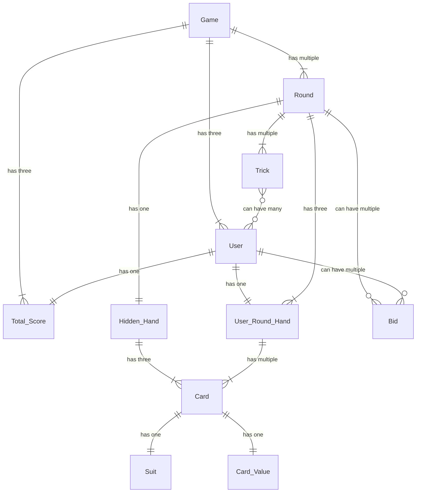

# Domain

```mermaid
erDiagram
    Game ||--|{ User : "has three"
    Game ||--|{ Total_Score : "has three"
    User ||--|| Total_Score : "has one"
    Game ||--|{ Round : "has multiple"
    Round ||--|{ Trick : "has multiple"
    Trick }o--o{ User : "can have many"
    User ||--|| User_Round_Hand : "has one"
    Round ||--|{ User_Round_Hand : "has three"
    Round ||--|| Hidden_Hand : "has one"
    Round ||--o{ Bid : "can have multiple"
    User ||--o{ Bid : "can have multiple"
    Hidden_Hand ||--|{ Card : "has three"
    User_Round_Hand ||--|{ Card : "has multiple"
    Card ||--|| Suit : "has one"
    Card ||--|| Card_Value : "has one"
```